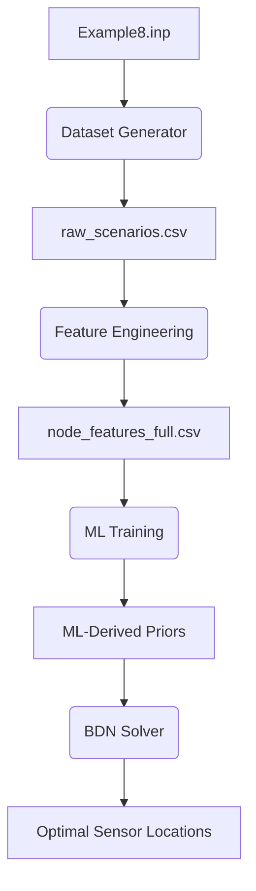

# Implementation Details: Hybrid AI for Sensor Placement

This document provides a technical walkthrough of the implemented codebase, explaining how it aligns with the **Hybrid AI framework** for optimal water quality sensor placement in urban drainage systems (Mhango & Sambito, 2026).

## 1. Pipeline Overview

The framework is a sequential pipeline that transforms a SWMM network definition into an optimized sensor configuration using Machine Learning (ML) to initialize a Bayesian Decision Network (BDN).

---

## 2. Core Components

### 2.1 Data Generation (`dataset_generator.py`)
- **Engine**: Uses `PySWMM` to programmatically execute EPA SWMM simulations.
- **Scenarios**: Generates 5,000–10,000 contamination events by varying:
    - **Source Node**: Sampled non-uniformly (J4, J10, JI18 at 2x probability).
    - **Mass**: $U[0.01, 0.5]$ kg.
    - **Duration**: $U[0.25, 3.0]$ hours.
- **Simulation**: Strictly 12-hour Dynamic Wave routing.
- **Features Extracted**:
    - `peak_conc`: Maximum concentration at each node.
    - `t_peak_min`: Time from injection to peak.
    - `mean_flow_m3s`: Average flow during the event.
    - `dist_src`: Shortest path pipe-segment distance from the injection source.
    - `detected`: Binary flag (1 if peak > 5 mg/L).

### 2.2 Feature Engineering (`feature_engineering.py`)
This script enriches the node-level data with structural and historical signals identified as informative in v1.0 of the framework:
- **Group 1 (Static Topology)**: Shortest path to outfall, betweenness centrality, downstream path count, and flow diversion fractions (calculated from weir/orifice geometry).
- **Group 3 (Bayesian Priors)**:
    - **Prior C**: Mean wastewater flux across 50 Monte Carlo runs.
    - **Prior D**: Mean contaminant flux across the same 50 runs.

### 2.3 ML Model Training (`train_models.py`)
Trains three candidate architectures to predict `detection_freq` (the target probability of a node detecting a random event):
- **Option A**: XGBoost / LightGBM (Gradient Boosting).
- **Option B**: 3-layer Feedforward Neural Network (MLP) with dropout.
- **Option C**: Graph Neural Networks (GCN/GAT) using PyTorch Geometric, representing the sewer as a directed graph.

**Output**: A "data-driven prior" vector $P(sensor \ at \ node \ i)$ normalized to sum to 1.

### 2.4 BDN Solver (`bdn_solver.py`)
Integrates the ML prior into the Bayesian Decision Network:
1. **Initialization**: Replaces the uniform or MC-derived prior with the ML-predicted probability distribution.
2. **Greedy Placement**: Sequentially selects nodes that maximize expected coverage.
3. **Bayesian Updating**: Samples random scenarios and updates node probabilities until the posterior converges.
4. **Evaluation**: Computes **F1 (Isolation Likelihood)** and **F2 (Detection Reliability)**.

---

## 3. Configuration and Execution

### 3.1 Worker Management
The flag `n_workers` in `config/default.yaml` controls parallelization. 
- **Value = 1**: Sequential execution (recommended for debugging and stability on Windows).
- **Value > 1**: Parallel execution using `ProcessPoolExecutor`.

### 3.2 Key Outputs
- `./output/raw_scenarios.csv`: The complete simulation database.
- `./ml_output/priors/`: Predicted sensor importance vectors for each model type.
- `./bdn_output/results/comparison_table.csv`: Direct performance comparison (Accuracy vs. Convergence Speed) between ML-BDN and the v1.0 baselines.
